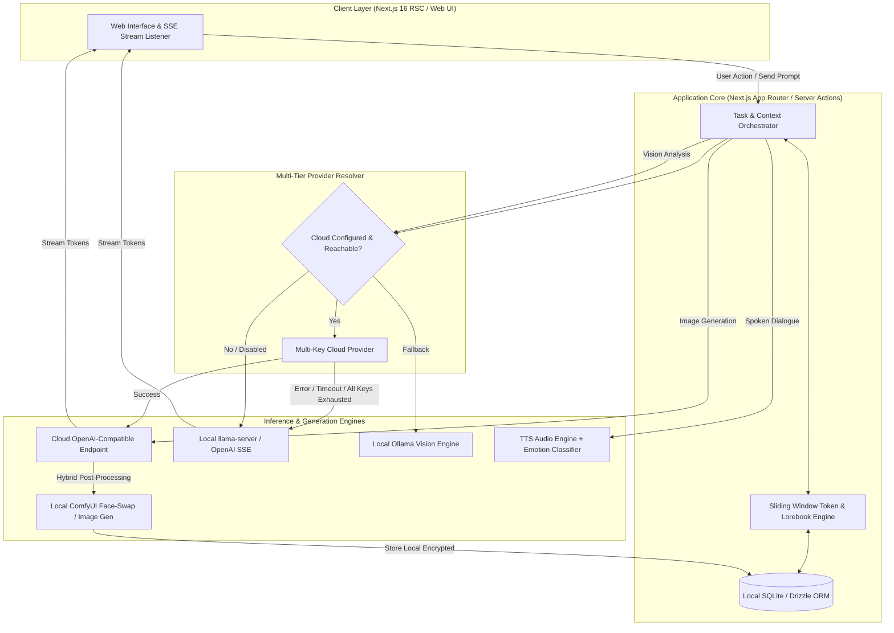

# Llamarole

An edge-first, single-user AI application architecture combining local on-device inference with resilient cloud-fallback orchestration, multimodal vision analysis, text-to-speech emotion routing, and localized image generation pipelines.

---

## Overview & Motivation

Modern generative AI applications frequently face trade-offs between zero-cost data privacy (local execution) and high throughput or model capabilities (cloud endpoints). 

This project began as an exploration into running zero-latency, private, quantized local LLMs (via `llama.cpp`/`llama-server` and `Ollama`) directly on Apple Silicon / consumer hardware. It has since evolved into a production-grade **hybrid local/cloud orchestration platform** featuring:
- Seamless multi-tier fallbacks across text, vision, and image pipelines.
- Deterministic sliding-window token budget allocators.
- End-to-end local data persistence with zero external data leakage for local-only tasks.

---

## Architecture & Request Lifecycle

The application acts as a local orchestrator managing structured contexts, dynamic knowledge retrieval, and model fallback cascades across multiple modalities.



---

## Technical Challenges Solved

### 1. Resilient Hybrid Fallback & Key Rotation
- **Multi-Key Pool**: Cloud text/image calls cycle across available API keys on HTTP `429` / rate limits.
- **Fast Failover**: Automatic lightweight connection probes (`pingCloudText`, `pingCloudVision`) fail early on network disruption, routing execution seamlessly to local `llama-server` or `Ollama` without dropping state.
- **Hybrid Post-Processing**: For image generation, the system supports cloud-rendered base imagery routed into a local `ComfyUI` pipeline for on-device identity preservation (face-swap), ensuring high image fidelity without exposing personal identity embeddings to external providers.

### 2. Context Window & Sliding Window Management
- Implemented an automatic sliding-window prompt builder with token caps (`LLAMAROLE_MAX_PROMPT_TOKENS`), preserving high-priority system prompts, dynamic lorebook injections, and the latest conversation turns while gracefully truncating historical dialogue.
- Recency × Importance decay algorithm for memory retrieval, ensuring top-K relevant facts and pinned summaries are embedded within the active context window.

### 3. Streaming SSE with Client Diagnostics
- Real-time Server-Sent Events (SSE) pipe token deltas to native UI components with automatic cancellation (`AbortController`) on user interrupt.
- Stream output validation inspecting stop sequences, token length exhaustion, unbalanced markdown markers, and unclosed quotes to trigger inline UI diagnostic banners.

### 4. Audio Extraction & Emotion Routing
- Custom AST-aware dialogue extraction separates narrative prose and action markers from spoken dialogue.
- Zero-temperature LLM classification detects emotional valence (`happy`, `sad`, `angry`, `whisper`, etc.) and formats input parameters for OpenAI-compatible TTS audio synthesis.

---

## Key Features

- **Configurable Persona & Workspace Engine**: Custom system prompts, scenarios, dialogue examples, and lorebooks with complex keyword/regex insertion logic and token budgeting.
- **Multi-Branch Message Swiping**: Branching assistant replies with swipe navigation (`◀ / ▶`), in-place regeneration, and branch preservation.
- **Multimodal Visual Analysis**: Structured avatar character parsing using multi-pass cloud vision or local vision models (`qwen2.5vl`).
- **Encrypted Local Media Store**: On-device AES encryption for generated visual assets stored directly in the local file hierarchy.
- **Integrated TTS & Emotion Modulation**: Spoken dialogue extraction and emotion-directed audio playback with custom voice mapping.

---

## Tech Stack

| Layer | Technology |
|---|---|
| **Framework** | Next.js 16 (App Router, Server Components, Server Actions) |
| **Language** | TypeScript 5 (Strict mode) |
| **Styling** | Tailwind CSS 4 |
| **Database & ORM** | SQLite via `better-sqlite3` (WAL Mode enabled), Drizzle ORM |
| **Validation** | Zod |
| **Local LLM Engine** | `llama-server` (`llama.cpp`), OpenAI-compatible SSE |
| **Local Vision Engine**| Ollama (`qwen2.5vl` / multi-pass vision) |
| **Image Pipeline** | Local ComfyUI (API-driven workflow injection) / Cloud API |
| **Testing** | Vitest, fast-check |
| **Package Manager** | `pnpm` |

---

## Project Structure

```
├── app/                  # Next.js App Router (pages, actions, and API routes)
│   ├── api/              # SSE endpoints, model proxies, and settings CRUD
│   ├── characters/       # Persona configuration and management
│   ├── chat/             # Chat interface and conversation streams
│   └── settings/         # Hybrid engine and provider configuration
├── components/           # UI components (native Tailwind primitives + chat panels)
├── data/comfyui/         # Source ComfyUI workflow definitions
├── lib/
│   ├── cloud-ai/         # Cloud provider connectors (text, vision)
│   ├── db/               # Drizzle schemas, migrations, and query interfaces
│   ├── imagegen/         # Hybrid image pipeline & prompt builders
│   ├── llama/            # Local llama-server client, samplers, and tokenizers
│   ├── lorebook/         # Dynamic world knowledge scanners & budgeters
│   ├── memory/           # Summarization and memory scoring routines
│   └── tts/              # Spoken dialogue extractor & emotion classifier
└── scripts/              # Process runners (llama-server lifecycle, migrations, port clearing)
```

---

## Getting Started

### 1. Prerequisites

- macOS (Apple Silicon recommended) or Linux.
- Node.js 22+ (Node 26 compatible).
- `pnpm` installed globally (`npm install -g pnpm`).
- `llama-server` (from `llama.cpp`):
  ```bash
  brew install llama.cpp
  ```

### 2. Installation & Database Setup

```bash
# Clone the repository
git clone <repo-url>
cd roleplay

# Install dependencies
pnpm install

# Run database migrations
pnpm db:migrate

# (Optional) Seed baseline configuration
pnpm tsx scripts/seed-chat.ts
```

### 3. Running the Application

**Production Mode (Recommended):**
```bash
# Starts llama-server, runs build, and starts server
bash scripts/start.sh

# Stop background services
bash scripts/stop.sh
```

**Development Mode:**
```bash
# Runs llama-server alongside Next.js development server
./scripts/dev.sh
```

Access the application at `http://localhost:3000`.

---

## Status

Active personal research and development exploration focused on local AI orchestration, edge ergonomics, and hybrid inference pipelines.
